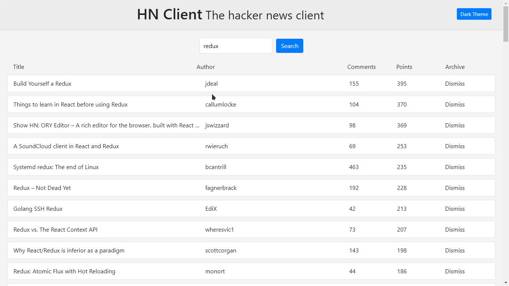
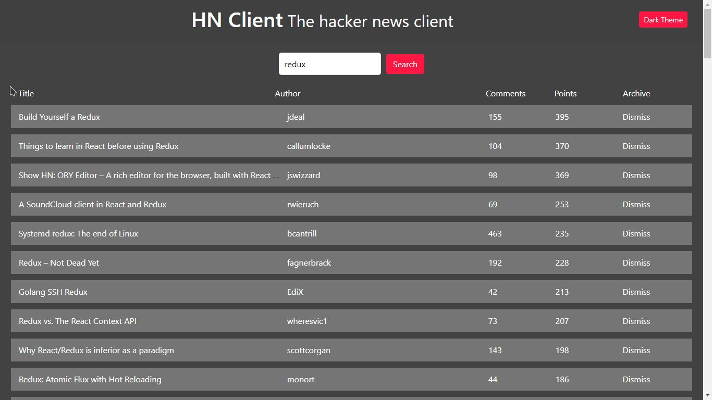

# HN Client

A minimalistic hacker news clone that enables you to find all the stories you love through a less intimidating interface. [HN Client](https://hacker-news-client-131.herokuapp.com)

## Features

- uses:
  - React (create-react-app)
  - Bootstrap
  - react-bootstrap
  - Hacker news api provided by [Algolia](https://www.algolia.com/)
- features:
  - Search bar
  - Dark theme

## Installation

- `git clone https://github.com/madstone0-0/hackernews.git`
- `cd hackernews`
- `npm install`
- `npm start`
- visit <http://localhost:3000/>
